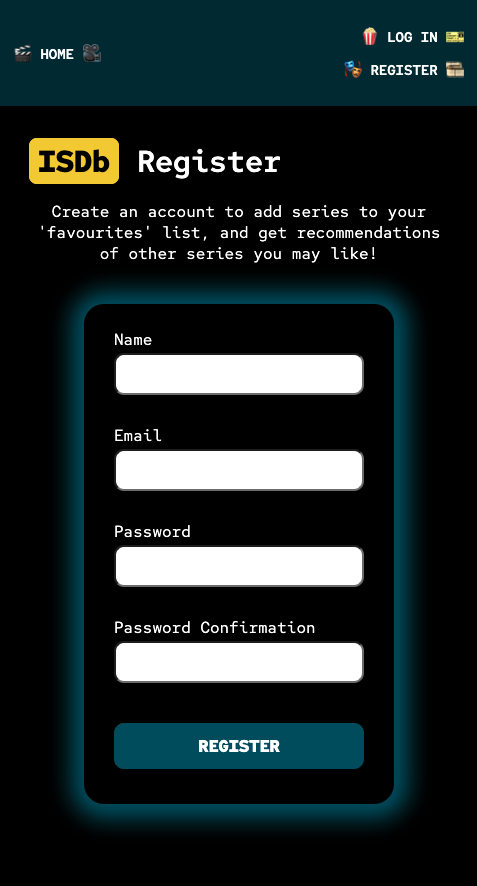

# Internet Series Database (ISDb)

ISDb is a fully tested, full stack **MERN** (MongoDB, Express, React & Node) web and mobile application that allows users to browse and filter TV series, add them to their 'favourites' list, get recommendations based on their favourites, and leave reviews and ratings; admins can further add new series to the catalogue. Seed data for the series was generated dynamically by **web scraping** IMDb, and the **recommender system** is a very simple one that generates series based on the modal genre of a user's favourites (the first is taken if more than one). 56 different aspects, components and functionalities are tests across **12 test suites**, server-side and client-side.

**This repo contains code for the front end client only; code for the back end api lives [here](https://github.com/emilydaykin/Internet-Series-Database-API).**

## Table of Contents  
1. [Application Walkthrough](#application-walkthrough)  
2. [Installation](#installation)  
3. [Tech Stack](#tech-stack)  
4. [Features](#features)  
5. [Architecture](#architecture) 
6. [Data Collection &#38; Curation](#data-collection--curation) 
7. [Featured Code Snippets](#featured-code-snippets) ([Front End](#front-end-client) & [Back End](#back-end-server))
8. [Challenges & Wins](#challenges--wins) 
9. [Key Learnings](#key-leanrings) 

# Application Walkthrough
### Series Catalogue
<p align="center">
  
</p>

### Expand and Collapse Search and Filter Tools (web vs mobile)
<p align="center">
  
  
</p>

## Favouriting & Recommendations Carousel
<p align="center">
  
</p>

## Responsive Carousel
<p align="center">
  
</p>
<p align="center">
  
  
  
</p>

## Leaving and Deleting your Review
<p align="center">
  
</p>

## Log In, Register and Add Series (admin-only) pages
<p align="center">
  
  
  
</p>


# Installation:
- Check out the [deployed version](#)!
- Or run and test locally:
  - **Back End**: Clone the [backend repo](https://github.com/emilydaykin/Internet-Series-Database-API) &rarr; Run MongoDB locally &rarr; `npm i` &rarr; `npm run test` (25 tests across 6 test suites) &rarr; `npm run start:server`
  - **Front End**: Clone this repo &rarr; `npm i` &rarr; `npm run test` (31 tests across 6 test suites) &rarr; `npm run start:client`

# Tech Stack
- Front End: React.js SPA, React-Router-Dom,  Sass (BEM)
- Back End: Node, MongoDB, Mongoose, Express, Python
- Data Collection: Web scraping with Python
- Authentication: JSON Web Token (JWT)
- Security:
  - Safeguarding from injection attacks: Express-Mongo-Sanitize
  - Password Encryption: Bcrypt
- Testing: 
  - Front end: Jest for mocks, React-Testing-Library
  - Back End: Mocha, Chai and Supertest
- Other Packages & Tools: Postman, MongoDB Compass, Axios, Elastic Carousel
- Deployment: 
  - Front end: Netlify
  - Back end: Heroku & Mongo Atlas


# Features
- Display of all series (XX were pre-seeded via scraping IMDb)
- An expand-collapse search and filter tool for the series catalogue.
  - Searching by title, actor, plot, year, genre or rating
  - Filtering by genre
- Series-specific information (genre, actors, pilot year, average rating etc...)
- Double-click functionality for logged in users to fill in the 'heart' on series poster, indicating the user has 'favourited' it
- Recommender System (for logged in users) to suggest series similar to ones they've liked. 
- Authenticated users can also:
  - Add a series to their profile's page via 'favouriting' (double clicking on the series poster on the individual series page)
  - View their profile page, which displays responsive carousels each for their favourites and resulting recommendations
    - The carousel cards will flip to its backside on hover, displaying series-specific information, and when active will navigate to series page
  - Comment on and rate a series once logged in, and deleting the user's own comment
- Admins have the same rights as non-admin users, but can also add new series to the catalogue
- The Register and Log In return detailed error messages to the user

# Architecture
### Front End:
- React Components to compartmentalise code
- React Hooks for state management and handling side effects
- Sass stylesheets that follow the 7-1 pattern and the BEM methodology
- Single Page Application (`react-router-dom`) using `Link`, `useNavigate`, `useLocation` and `useParams`
- Unit testing (31 tests across 6 test suites):
  - Home (6 unit tests)
  - Navbar (1 unit test)
  - Login (4 unit tests)
  - Register (11 unit tests)
  - UserProfile (3 unit tests & 2 integration tests)
  - ElasticCarousel (4 unit tests)

### Back End:
- Secure routing middleware to ensure user groups (authenticated users and admins) are granted appropriate access rights
- Error handling middleware to assist with debugging
- Two interlinked model schemas in MongoDB (Series and User), one of which (Series) has a nested Comments model
- Data seeding of 25 user profiles, 15 comments and 3 posts.
- All security checks (user access credentials) done in the back end:
  - Email validation (correct format and uniqueness)
  - Password validation (encryption and strength: minimum of 8 characters, at least one lowercase & uppercase letter and number)
  - Obscuring the password response from the front end
  - Login credentials expire after 6 hours
- Integration testing (25 tests across 6 test suites):
  - Series via GET requests (4 integration tests)
  - Series via POST requests (3 integration tests)
  - Register & Login POST requests (4 integration tests)
  - Favourites & User Authentication via GET and PUT requests (4 integration tests)
  - Comments / Reviews via POST, DEL and GET requests (4 integration tests)
  - Admin authentication via GET and POST requests (6 integration tests)

# Data Collection & Curation
- Dynamically generated seed **series** data via a Python script that scrapes IMDb (see code snippet below).
- Manually generated seed **comments** via Mongoose once the User and Series models were seeded (see code snippet below).
  

# Featured Code Snippets
### Front End (Client)
- Recommender System (generates a list of series based on the modal genre of a user's favourites):

  ```
  // Full code: $src/components/UserProfile.js

  const getRecommendations = () => {
    if (allSeries && favourites) {
      const nonLikedSimilaries = allSeries.filter(
        (series) =>
          series.genre.includes(calculateFavouriteGenre()) &&
          !favourites.map((likedShow) => likedShow._id).includes(series._id)
      );
      const shuffledList = [...nonLikedSimilaries].sort(() => 0.5 - Math.random());
      return shuffledList.length >= 12 ? shuffledList.slice(0, 12) : shuffledList;
    } else {
      return [];
    }
  };
  ```
- Carousel and card flip design in CSS. The carousel takes props that will show either favourites or recommendations:

  ```
  // Full code: $src/components/ElasticCarousel.js

  const ElasticCarousel = ({ seriesList, listType }) => {
    const responsiveBreakPoints = [
      { width: 1, itemsToShow: 1 },
      { width: 550, itemsToShow: 2, itemsToScroll: 2 },
      { width: 768, itemsToShow: 3 },
      { width: 1200, itemsToShow: 4 }
    ];

    return (
      <div className='carousel'>
        {seriesList && seriesList.length > 0 ? (
          <Carousel breakPoints={responsiveBreakPoints}>
            {seriesList.map((series) => (
              <Link
                key={series._id}
                to={`/series/${series._id}`}
                className={`card card--${listType}`}
              >
                <div className='card__side card__side--front'>
                  
                </div>
                <div className='card__side card__side--back'>
                  <p className='card__title'>{series.name}</p>
                  <p className='card__details card__details--years'>
                    ({series.pilotYear}&#8212;{series.finaleYear})
                  </p>
                  <p className='card__details card__details--rating'>⭐️ {series.rating} ⭐️</p>
                  <p className='card__details card__details--genres'>{series.genre.join(' • ')}</p>
                  <p className='card__details card__details--actors'>
                    {series.actors.map((actor) => (
                      <span key={actor}>{actor}</span>
                    ))}
                  </p>
                </div>
              </Link>
            ))}
          </Carousel>
        ) : (
          <p>
            {listType === 'favourites'
              ? 'No favourites yet.'
              : 'No recommendations yet. Add some series to your Favourites list get some recommendations!'}
          </p>
        )}
      </div>
    );
  };
  ```
  ```
  // Full code: $src/styles/components/_elastic-carousel.scss
  
  .card {
    perspective: 150rem;
    
    &__side {
      transition: all .8s ease;
      backface-visibility: hidden;
      position: relative;

      &--back {
        transform: rotateY(180deg);
        position: absolute;
        top: 0;
        left: 0;
        height: 100%;
        width: 100%;
      }
    }

    &:hover &__side--front {
      transform: rotateY(-180deg);
    }

    &:hover &__side--back {
      transform: rotateY(0);
      overflow-y: scroll;

      &::-webkit-scrollbar {
        width: .5rem;
      }

      &::-webkit-scrollbar-thumb {
        border-radius: 1rem;
        background-color: rgba($theme-grey, .6);
      }
    }
  }
  ```
- Unit Testing the Home page's search bar and filter buttons
  ```
  test('Assert search bar input is accepted and displayed correctly.', async () => {
    await act(async () =>
      render(
        <BrowserRouter>
          <Home />
        </BrowserRouter>
      )
    );
    const searchBarInput = screen.getByRole('textbox', { className: /home__search-bar/i });
    expect(searchBarInput).toBeInTheDocument();

    const searchTerm = 'sherloc';
    userEvent.type(searchBarInput, searchTerm);

    await waitFor(() => {
      expect(searchBarInput.value).toEqual(searchTerm);
    });
  });

  test('Assert genre filters are displayed correctly based on series available.', async () => {
    axios.get = jest.fn();
    axios.get.mockResolvedValueOnce({ data: mockSeriesData });

    await act(async () =>
      render(
        <BrowserRouter>
          <Home />
        </BrowserRouter>
      )
    );

    // Assert filter 'heading' is displayed
    const filterHeading = screen.getByText(/filter by genre/i, {
      className: 'home__controls-heading'
    });
    expect(filterHeading).toBeInTheDocument();

    // Assert genre options are displayed:
    const genresPresent = ['Crime', 'Drama', 'Biography'];
    genresPresent.forEach((genre) => {
      const genreFilterButton = screen.getByText(genre, { className: 'home__filter' });
      expect(genreFilterButton).toBeInTheDocument();
    });

    // Assert genres that aren't present in mockSeriesData is NOT part of filter list:
    const genresMissing = ['Fantasy', 'History', 'Reality-TV'];
    genresMissing.forEach((genre) => {
      const genreFilterButton = screen.queryByText(genre, { className: 'home__filter' });
      expect(genreFilterButton).not.toBeInTheDocument();
    });
  });
  ```

### Back End (Server)
- Scraping IMDb:

  ```
  # Full code: $db/data/scraping_imdb.py

  def extract_years(years):
    years_split = years.split('–')
    assert len(years_split) <= 2, '`Years` was not split correctly'
    assert len(years_split) >0, '`Years` was not split correctly'
    pilot_year = years_split[0]
    finale_year = 'ongoing' if len(years_split) == 1 else years_split[1]
    return pilot_year, finale_year

  for index, url in enumerate(URLs):
    try:
      print(f'{index+1}/{len(URLs)}: Scraping {url}...')
      page = requests.get(url)
      soup = BeautifulSoup(page.content, 'html.parser')
      
      # Separate class name in IMDb for super long titles:
      if url == 'https://www.imdb.com/title/tt13315324/?ref_=nv_sr_srsg_0':
          title = soup.find_all('h1', class_='sc-b73cd867-0 cAMrQp')[0].text
      else:
          title = soup.find_all('h1', class_='sc-b73cd867-0 eKrKux')[0].text
      years = soup.find_all('span', class_='sc-52284603-2 iTRONr')[0].text
      poster = soup.find('img', class_='ipc-image')['src']
      genres_elements = soup.find_all(
          'a', class_='sc-16ede01-3 bYNgQ ipc-chip ipc-chip--on-baseAlt')
      genres = [genre.text for genre in genres_elements]
      description = soup.find_all('span', class_='sc-16ede01-1 kgphFu')[0].text
      rating = soup.find_all('span', class_='sc-7ab21ed2-1 jGRxWM')[0].text
      top_3_actor_elements = soup.find_all('a', class_='sc-11eed019-1 jFeBIw')[:3]
      top_3_actors = [actor.text for actor in top_3_actor_elements]
      number_of_episodes = soup.find_all('span', class_='ipc-title__subtext')[0].text
      language = soup.find_all('a', class_='ipc-metadata-list-item__list-content-item ipc-metadata-list-item__list-content-item--link')[-7].text
      pilot_year, finale_year = extract_years(years)

    except Exception as err:
      print(f'Error "{err}" for the URL {url}')
  ```
- Creating comments data using the User and Series models:

  ```
  // Full code: $db/seed.js

  const user1 = await User.findOne({ username: 'sierra' });
  const lastDance = await Series.findOne({ name: /last dance/i });

  lastDance.comments.push(
    createComment(
      "Breath-taking. Can't believe they had all that terrific footage. For all the sports fans out there.",
      5,
      user1._id,
      user1.username
    )
  );
  
  await lastDance.save();
  ```
- API endpoint to update (add or remove) a series from a user's "favourites" list:

  ```
  // Full code: $controllers/usersController.js

  const addUserFavourites = async (req, res, next) => {
    try {
      if (!req.currentUser) {
        res
          .status(400)
          .json({ message: "Unauthorised. You must be logged in to 'favourite' a series" });
      } else {
        // Get series (that user clicked on):
        const series = await Series.findById(req.body.seriesId);
        const userFavouritedAlready = !!req.currentUser.favouriteSeries.find(
          (item) => item._id.toString() === req.body.seriesId
        );
        if (userFavouritedAlready) {
          // remove from favourites list if already in list
          await User.updateOne({ _id: req.currentUser._id }, { $pull: { favouriteSeries: series } });
        } else {
          // add to favourites list if not in there
          await User.updateOne({ _id: req.currentUser._id }, { $push: { favouriteSeries: series } });
        }
        const updatedUser = await User.findById(req.currentUser._id);
        res.status(200).json(updatedUser);
      }
    } catch (err) {
      next(err);
    }
  };
  ```
- Testing some Comments Controller's POST and GET request endpoints:

  ```
  // Full code: $__tests__/comment.test.js

  let userToken;
  let userId;
  let seriesId;

  describe('Testing COMMENTS', () => {
    beforeEach(() => setUp());
    beforeEach(async () => {
      // Get a user token (the one who's written comments):
      const resp = await api
        .post('/api/login')
        .send({ email: 'jo@user.com', password: 'Password1!@' });
      userToken = resp.body.token;
      const jwtDecoded = jwt.verify(userToken, secret);
      userId = jwtDecoded.userId;

      // Get a series id:
      const seriesResp = await api.get('/api/series/arrested');
      seriesId = seriesResp.body[0]._id;
    });
    afterEach(() => tearDown());

    it('Assert user can create a review on a series (POST & GET)', async () => {
      const resp = await api
        .post(`/api/series/${seriesId}/comments`)
        .set('Authorization', `Bearer ${userToken}`)
        .send(mockComment);
      expect(resp.status).to.eq(201);

      // check comment is there:
      const getResp = await api.get('/api/series/arrested');
      expect(getResp.body).to.be.an('array');
      expect(getResp.body.length).to.eq(1);
      const comments = getResp.body[0].comments;
      expect(comments).to.be.an('array');
      expect(comments.length).to.eq(2);
      const targetComment = comments.find((comment) => comment.text === 'Not bad');
      expect(targetComment.rating).to.eq(4);
      expect(targetComment.createdById).to.eq(userId);
      expect(targetComment.createdByName).to.eq('jo');
    });

    it('Assert error when unauthenticated user tries to leave a review on a series (POST)', async () => {
      const resp = await api.post(`/api/series/${seriesId}/comments`).send(mockComment);
      expect(resp.status).to.eq(401);
      expect(resp.body.message).to.deep.include('Unauthorised. No token or invalid token.');
    });

    ...

  });
  ```

# Challenges & Wins:
This was the first time I'd ever implemented testing in javascript, so learning Jest and React Testing Library for front end testing, and mocha/chai/supertest??? for the back end was incredibly rewarding.

# Key Learnings:
- It's always easier to get the data needed in the front end by creating a new api endpoint in the back end, rather than appending it to a user's (JWT) token payload, which doesn't update as easily/in real time in session storage.
- When testing, any action (based on a user event or inital load) that causes the state to re-render must be wrapped in `act(...)`
- Testing components that are only accessible to authenticated users is done the same way as testing any other (public) component; the component is there in the codebase whether a user signs in or not, so when provided jest mock data, those components can be tested!